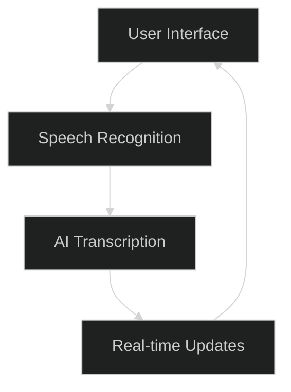
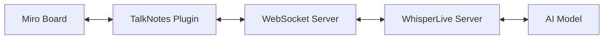

# TalkNotes for Miro: Project Blueprint

## 1. Project Overview

TalkNotes is an AI-powered speech-to-text application integrated with Miro, enabling real-time transcription of spoken words directly onto Miro boards.

## 2. Core Components

1. User Interface: Miro plugin interface
2. Speech Recognition: Capture audio input
3. AI Transcription: Convert speech to text using WhisperLive
4. Real-time Updates: Continuously update board with new text

## 3. Technical Architecture

## 4. Key Features

- Real-time speech-to-text conversion
- Multi-language support

## 5. Development Phases

1. Initial Setup

   - Set up development environment
   - Create Miro app

2. Core Functionality

   - Implement basic UI in Miro
   - Set up WebSocket server
   - Integrate WhisperLive

3. Miro Integration

   - Implement sticky note placement on Miro board
   - Handle real-time updates

## 6. Potential Challenges

- Latency in real-time transcription
- Ensuring accuracy across different accents and languages

## 7. Resources Required

- Server for hosting WebSocket and WhisperLive
- GPU resources for AI model (if using GPU version)
